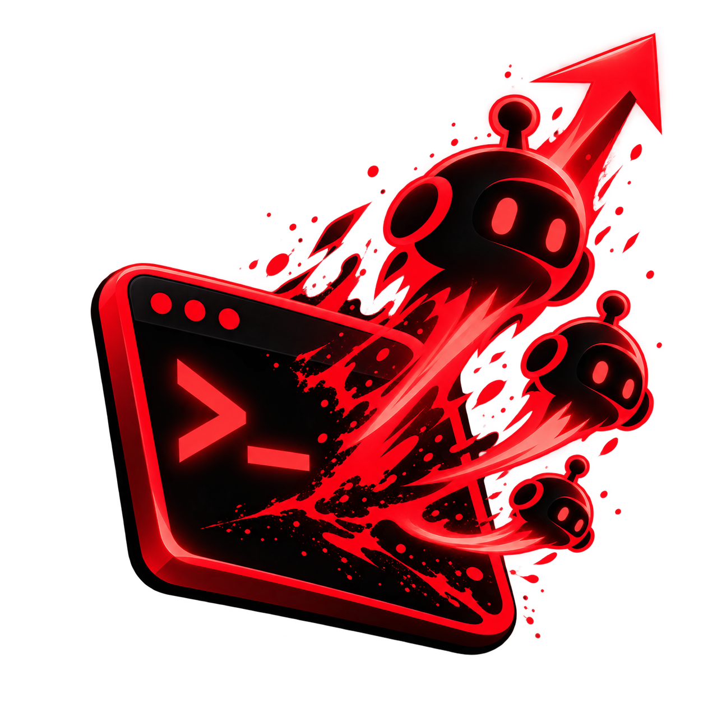
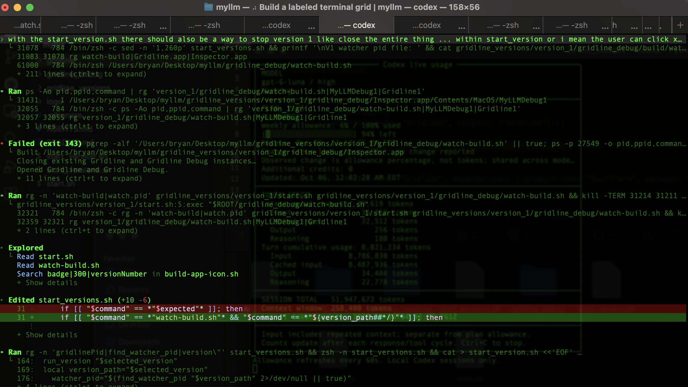

<div align="center">
  
  <h1>Gridline</h1>
  <p><strong>Your agents want out of the tab bar.</strong></p>
  <p>Give each one a mission, its own terminal, and room to see it through.</p>
</div>



That wall of tabs is the problem: every new request adds another place to lose context. Which agent is handling what? Which project belongs to this terminal? Gridline turns tab sprawl into a clear map of work. Give each human request a named workflow, its own Codex terminal, and the right project folder—then see every assignment side by side.

## A focused home for every workflow

- **Name the mission.** Create a work group for a request like “Fix sign-in” or “Prepare the release.”
- **Give it a dedicated terminal.** Start Codex in that group so the session has a clear home and purpose.
- **Set the project context.** Choose the folder where that assignment belongs.
- **Keep parallel work legible.** Arrange groups in one, two, or three columns, collapse what is not in focus, and jump to an assignment from the sidebar.
- **Return to an organized workspace.** Gridline saves group names, folders, labels, and layout on your Mac. Terminal sessions start fresh after the app closes.
- **Built for macOS.** A native SwiftUI and AppKit app, with local terminal sessions powered by SwiftTerm.

## Vibe-code your terminal workflow

Gridline is open source and made to grow with the way you work. Use the companion **Gridline Debug** inspector to click an interface element, copy its Accessibility details and likely source-code path, then tell your coding assistant what you want changed. Describe the workflow you want; Gridline gives your assistant useful context to start shaping it.

## Build and run

Gridline is an open source macOS app. To build it from this repository, use macOS 13 or newer with Xcode Command Line Tools installed:

```sh
git clone https://github.com/reactnodejs322/gridline.git
cd gridline
./start.sh
```

The first build downloads SwiftTerm through Swift Package Manager. `start.sh` builds and opens Gridline and its companion Gridline Debug inspector, then keeps a watcher running in the terminal. Install the Codex CLI separately to start Codex sessions.

Gridline Debug uses macOS Accessibility permission to inspect Gridline’s interface. The inspector does not read terminal text or keystrokes. You can also build just Gridline with `./gridline/build-app.sh` and open `gridline/Gridline.app`.

## Project status

Gridline is under active development. It focuses on organizing parallel terminal work: groups, folders, labels, navigation, and a persistent workspace layout. Closing or rebuilding the app ends active terminal sessions; the workspace organization is saved locally.
